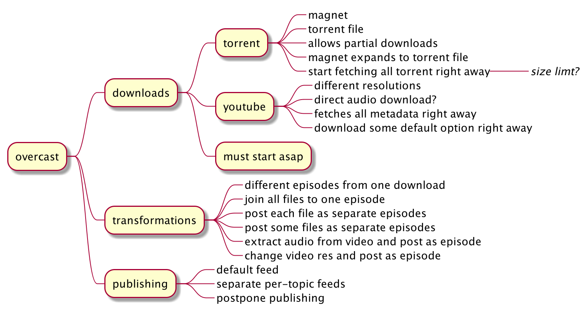

#Undercast
**In its core, undercast is a system that allows downloading media 
from different sources, transforming said media 
and serving is as a podcast feed.**

## Mindmap
Here is a mindmap I doodled while thinking about it

## Questions
These are some questions that popped in my head after I made a mindmap:
 - What is an input for a download? **Just a link!**
 - Is there a download entity and some kind of download meta entity? **Nope!**
 - What if one download appears in two episodes? **Episode tells which file of download does it use**
 - Do we really download all the torrent? **We can choose only supported media and also limit size**
 - What to download in a youtube case? **IDK, 720p?**
 - For youtube, can we really fetch audio? **Needs research**
 - For youtube, do we allow playlists? **Would be nice**

## Flow
### 1. User adds a download.
- User can use a magnet link
- User can upload a torrent file
- User can link to a youtube video
- Could be done via Telegram bot
- Could be done via email

### 2. User chooses files and transformations
- User can select all chapters of an audiobook, 
sort them and publish whole book as a single episode of a feed
- User can select all chapters of an audiobook, 
sort them and publish as separate episodes of a feed
- User can extract audio of an youtube video
- User can publish raw youtube video
- User can select videos of a youtube playlist, sort them and publish as separate episodes
- User can select videos of a youtube playlist, sort them and publish audio as separate episodes

### 3. User adds podcast feed to a client

## Roadmap
### Version 1
- Magnet link
- All chapters to an episode on default feed

### Version 2
- Youtube
- Raw video to an episode on default feed

### Version 3
- Extra feeds
- Episode per chapter

### Version 4
- Youtube playlists

### Version 5
- Youtube audio

### Version 6
- Postponed posting
